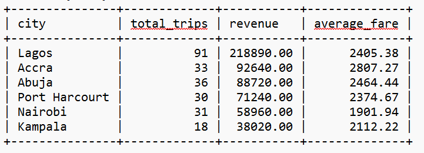
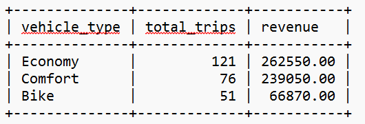
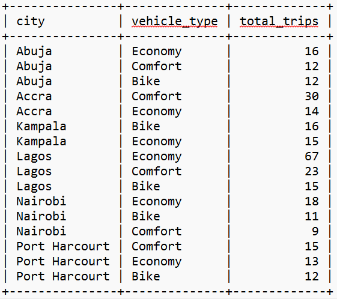

# 🚕 ZoomRide SQL Analysis

---

## 🔎 Quick Navigation

[📌 Overview](#-project-overview) •
[🎯 Business Questions](#-business-questions-answered) •
[🛠️ Tools](#️-tools-used) •
[🧹 Data Quality](#-data-quality) •
[📈 Analysis Results](#-analysis-results) •
[💡 Insights](#-key-insights) •
[💼 Manager Message](#-message-to-the-manager) •
[📁 Files](#-files-in-repository) •
[✅ Conclusion](#-conclusion)

---

## 📊 Project Overview

**ZoomRide** is a ride-hailing company operating across six African cities. This project uses **MySQL** to analyze 
customer, driver, and trip data and turn the raw records into practical business insights.

The analysis focuses on **trip activity, revenue, city performance, vehicle type usage, customer activity, monthly 
trends, and data quality**.

The dataset was deliberately designed with real-world-style inconsistencies, making data validation and cleaning an 
important part of the analysis.

Rather than simply querying the data, the project follows a practical analysis process:

**Explore → Validate → Clean → Analyze → Interpret → Recommend**

### 🌍 Dataset Coverage

* **40** customers
* **20** drivers
* **300** trip records
* **6** African cities
* **3** vehicle types: Economy, Comfort, and Bike
* Fares recorded in **Nigerian Naira (₦)**
* Cancelled trips recorded with a fare of **0**

---

## 🎯 Business Questions Answered

The analysis was designed to answer questions that could help ZoomRide understand its operations and make better decisions.

* 💰 Which cities generate the most revenue?
* 🚕 How many completed trips does each city generate?
* 💵 What is the average fare by city?
* 🚗 Which vehicle types generate the most trips and revenue?
* 👥 Which customers have the highest trip activity and revenue contribution?
* 📅 How does trip revenue change over time?
* 🛣️ Which trips cover the longest distances?
* 🧹 What data-quality issues could affect the analysis?
* 💼 Which city should ZoomRide prioritize for investment?

---

## 🛠️ Tools Used

### 🐬 MySQL

MySQL was used throughout the project for:

* Data exploration
* Data validation and cleaning
* Filtering and sorting
* Aggregation
* Joining related tables
* Revenue analysis
* City-level analysis
* Customer analysis
* Duplicate detection
* Data-quality checks

### 🧮 SQL Techniques

The analysis applied:

* `SELECT`
* `WHERE`
* `GROUP BY`
* `ORDER BY`
* `HAVING`
* `INNER JOIN`
* `COUNT()`
* `SUM()`
* `AVG()`
* `ROUND()`
* `MIN()`
* `MAX()`
* `CASE`
* Conditional filtering
* Duplicate identification
* Data validation

---

## 🧹 Data Quality

Before drawing conclusions from the data, I reviewed the dataset for issues that could affect the accuracy of the analysis.

### 1. Missing Fare Values

I identified **9 completed trips with missing (`NULL`) fare values**.

This was important because a missing fare can create inconsistencies in revenue and average-fare calculations. For example,
`COUNT(*)` can include a trip with a missing fare, while `SUM(fare)` and `AVG(fare)` do not include the `NULL` value.

The affected records were therefore excluded from fare-based calculations where appropriate.

### 2. Duplicate Trips

I also identified **two potential duplicate trip pairs** by comparing the customer, driver, trip date, and fare.

The duplicate pairs were:

* Trip IDs **82 and 299**
* Trip IDs **253 and 300**

After reviewing the records, trips **299 and 300** were confirmed as duplicates and removed, while the original 
records were retained.

### 3. Inconsistent City Names

The dataset also contained inconsistent city names, including:

* `Lagos` / ` Lagos`
* `Accra` / ` Accra`
* `Nairobi` / `Nairobbi`
* `Kampala` / `Kampla`
* `Port Harcourt` / `Port-Harcourt` / `PH`

These variations could cause the same city to appear as separate groups during analysis.

The city names were normalized so that city-level results would be grouped correctly.

---

## 📈 Analysis Results

### 💰 Revenue by City

Lagos generated the highest revenue among the six cities analyzed.

Lagos stands out not only because of its revenue, but also because of its significantly higher completed-trip volume.

---

### 🚗 Revenue by Vehicle Type

Economy recorded the highest trip volume and generated the highest total revenue among the three vehicle types.

---

### 🌍 Vehicle Type Preferences by City

To understand demand more closely, I analyzed vehicle-type usage at the city level.

The results show that vehicle preferences are not the same across all markets.

**Economy** leads in Lagos, Abuja, and Nairobi, while **Comfort** leads in Accra and Port Harcourt. 
**Bike** records the highest trip volume in Kampala.

This suggests that vehicle deployment could be tailored to the demand patterns of individual cities.

---

## 💡 Key Insights

* 🇳🇬 **Lagos was the strongest revenue market**, generating **₦218,890 from 91 completed trips**.
* 💵 **Accra recorded the highest average fare**, at **₦2,807.27** per completed trip.
* 🚗 **Economy was the most frequently used vehicle type**, with **121 trips** and **₦262,550** in revenue.
* 🌍 **Vehicle preferences vary by city**. Economy leads in Lagos, Abuja, and Nairobi; Comfort leads in Accra 
        and Port Harcourt; while Bike leads in Kampala.
* 👥 **Chioma Nwosu recorded the highest number of trips**, with 21 trips.
* 📅 **December 2025 recorded the highest monthly revenue**, at **₦66,980**.
* 🧹 **Data-quality issues could materially affect business results**, particularly the 9 missing fares and 
        2 confirmed duplicate trips.
* 📊 The analysis shows the importance of **cleaning and validating data before using it to support business decisions**.

---

## 💼 Message to the Manager

### Recommendation

ZoomRide should invest in **Lagos**, which generated the highest revenue at **₦218,890 from 91 completed trips**, 
compared with **Accra's ₦92,640 from 33 trips**.

I found **9 completed trips with missing fares and 2 confirmed duplicate trips**. If left unfixed, these issues 
could distort fare calculations and inflate trip counts and revenue.

Before making a major investment decision, I would like to know whether Lagos's higher demand is sustainable and 
what is driving it — more customers, higher trip frequency, or stronger demand for particular vehicle types.

This would help determine whether Lagos offers the strongest **long-term growth opportunity**.

---

## 📁 Files in Repository

* [ZoomRide Setup SQL](zoomride_setup.sql)
* [ZoomRide Analysis SQL](zoomride_analysis.sql)
* [Revenue by city](revenue_by_city.png)
* [Revenue by vehicle type](revenue_by_vehicle-type.png)
* [vehicle type preference by city](vehicle-type_preference_by_city.png)
* [README](README.md)

---

## ✅ Conclusion

The **ZoomRide SQL Analysis** demonstrates how SQL can be used to move from raw operational data to meaningful 
business insights.

The project combines **data cleaning, validation, relational joins, aggregation, revenue analysis, customer analysis, 
vehicle-type analysis, city-level analysis, and trend analysis**.

The findings identify **Lagos as the strongest revenue market** while showing that vehicle preferences differ across 
cities. More importantly, the project demonstrates that reliable business analysis requires both **accurate data and 
the ability to translate technical findings into practical recommendations**.
